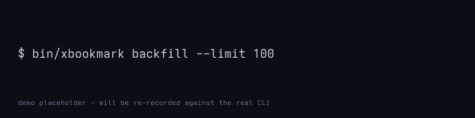

# xbookmark

Own your X bookmarks as a local, Obsidian-ready bookmark wiki with LLM enrichment and Whisper transcription.

xbookmark pulls your X (formerly Twitter) bookmarks through the official paid X API v2, writes each one to a plain markdown file with YAML frontmatter, runs an LLM enrichment pass for summaries and tags, and transcribes any linked audio or video locally with Whisper.

It is built for people who keep notes in Obsidian or any markdown-first system and are tired of X bookmarks being unsearchable and ephemeral. xbookmark writes to its own standalone bookmark wiki directory; point Obsidian at that folder when you want to browse it. Everything runs on your machine; nothing leaves it except the calls you authorize to the X API and your configured LLM provider.

<p align="center">
  <a href="https://github.com/ivankuznetsov/xbookmark/actions/workflows/ci.yml"></a>
  <a href="#roadmap"></a>
  <a href="LICENSE"></a>
  
</p>

<p align="center">
  
</p>

Clone, install dependencies, and copy the env template:

```bash
git clone https://github.com/ivankuznetsov/xbookmark.git
cd xbookmark
bundle install
cp .env.example .env
```

Stop here and edit `.env` to fill in `X_CLIENT_ID`, `X_USER_ID`, and `XBOOKMARK_WIKI_PATH` — see [Configuration → Set up X API access](#set-up-x-api-access) for how to obtain the X values. Then run:

```bash
bin/xbookmark auth login
bin/xbookmark install
bin/xbookmark backfill --limit 100
bin/xbookmark find 'rails'
```

Example `find` output:

```
bookmarks/2026/05/1789012345678901234.md  "Rails 8.0 ships with..."  @dhh
bookmarks/2026/04/1788123456789012345.md  "A small Rails tip..."     @rosa
```

## Quick install with an AI agent

If you use Claude Code, Cursor, Codex, ChatGPT, or any other AI assistant, paste the prompt below and let it install and configure xbookmark for you. Agents with shell access run the steps; chat-only agents walk you through them.

```text
Install and configure xbookmark from https://github.com/ivankuznetsov/xbookmark on this machine.

1. Read README.md from that repo and follow the Installation section that matches my operating system.
2. Follow the Configuration section: copy .env.example to .env, ask me for my X developer Client ID, numeric X user ID, and bookmark wiki path, and fill them in. Leave X_CLIENT_SECRET blank unless I say my X app is a confidential client.
3. Run `bin/xbookmark auth login` so I can sign in to X in my browser.
4. Install the daily scheduler with `bin/xbookmark install`.
5. Verify with `bin/xbookmark --version` and `bin/xbookmark auth status`, then report the output.

Stop and ask me before installing system packages with sudo, and before any step that would overwrite a file in my home directory.
```

If you prefer to run the steps yourself, jump to [Installation](#installation) and [Configuration](#configuration) below.

## Features

- One-shot backfill of your entire X bookmark history into a local bookmark wiki.
- Daily incremental ingest via a built-in scheduler (systemd on Linux, launchd on macOS).
- Obsidian-friendly markdown output with YAML frontmatter and stable file naming.
- Full-text search over the bookmark wiki via a local QMD index (a markdown full-text search engine).
- LLM enrichment (summary, tags) via the [`codex`](https://github.com/openai/codex) CLI.
- Local Whisper transcription of audio and video linked from a bookmark, with
  LLM-produced transcript summaries and readable dialogue-style formatting.
- Obsidian graph landing pages for authors, topics, entities, and threads.
- Official X API v2 only, via OAuth 2.0 with PKCE.
- MIT-licensed and runs entirely on your machine.

## Installation

xbookmark ships pre-built single-file binaries for `x86_64-linux` and
`arm64-darwin`.  Pick the channel that matches your host:

| Channel | One-liner |
|---------|-----------|
| Homebrew (macOS, arm64) | `brew install ivankuznetsov/tap/xbookmark` |
| AUR (Arch / Manjaro) | `yay -S xbookmark` |
| `.deb` (Debian / Ubuntu, x86_64) | `sudo apt install ./xbookmark_<ver>_amd64.deb` |
| Generic `curl \| sh` | `curl -fsSL https://github.com/ivankuznetsov/xbookmark/raw/main/install.sh \| sh` |

After install, run `xbookmark` once — it auto-launches the interactive
setup wizard, which writes your X API credentials to the host keystore
(libsecret on Linux, login Keychain on macOS), removes stale invalid Codex
service-tier values that can break scheduled runs, and enables the daily sync
timer.

### Upgrades

Upgrade via the same channel you installed from — `brew upgrade
xbookmark`, `yay -Syu xbookmark`, `apt upgrade xbookmark`, or re-run
`install.sh`.  There is no in-binary `xbookmark update`.

### Uninstall

```bash
xbookmark uninstall --purge      # remove scheduler unit, keystore entries, config dir
# then, depending on channel:
brew uninstall xbookmark         # macOS
sudo pacman -R xbookmark         # Arch
sudo apt remove xbookmark        # Debian/Ubuntu
sh <(curl -fsSL https://github.com/ivankuznetsov/xbookmark/raw/main/uninstall.sh)  # curl|sh path
```

Running the package-manager removal before `xbookmark uninstall
--purge` is supported but leaves orphan keystore entries behind; the
order above keeps the box clean.

### Troubleshooting

- **`ruby not found`** — the Tebako binary bundles its own Ruby, so
  this should never appear after the binary install.  If you see it,
  re-run `install.sh` and confirm the binary is on PATH.
- **`secret-tool missing` (Linux)** — install
  `libsecret`/`libsecret-tools` for your distro; otherwise xbookmark
  falls back to a 0600 `.env` at `~/.config/xbookmark/.env`.  `xbookmark
  doctor` always prints the active backend on its `keystore:` line.
- **Scheduler did not enable** — re-run `xbookmark install`.  On
  Arch/Linux you may need `loginctl enable-linger $USER` to fire while
  logged out; macOS launchd needs no extra setup.
- **macOS Gatekeeper quarantines the binary** — run `xattr -d
  com.apple.quarantine $(which xbookmark)`.

### Optional runtime tools

xbookmark detects the following at runtime and prints copy-pasteable
install commands when they are missing.  None of them are required to
launch the wizard:

- `ffmpeg` — media extraction.
- `whisper.cpp` / `faster-whisper` — local transcription.
- `codex` — LLM enrichment (`https://github.com/openai/codex`).
- `qmd` — vector search over the bookmark wiki.

Run `xbookmark doctor` to see which ones the binary can find, and
`xbookmark doctor --fix` to interactively install the missing ones via
the host package manager.

### Building from source

If you prefer a source build, clone the repo and `bundle install`
against Ruby 3.1 or newer.  Source builds skip Tebako entirely.

```bash
git clone https://github.com/ivankuznetsov/xbookmark.git
cd xbookmark
bundle install
bin/xbookmark --version
```

## Configuration

xbookmark reads configuration from dotenv files. Resolution order is:
`XBOOKMARK_ENV_FILE`, `$PWD/.env`, then `~/.config/xbookmark/.env`.
Scheduled jobs keep using the env file that was loaded during installation,
so they do not depend on the scheduler's working directory.

Copy the example and fill in the values:

```bash
cp .env.example .env
```

### Configuration file

`.env.example` is the canonical key list. Keep real credentials only in
`.env` or another gitignored config file; do not edit `.env.example` with
secrets.

### Set up X API access

1. Sign in at the [X developer portal](https://developer.x.com) and create a project, then create an app inside it.
2. Enable OAuth 2.0 on the app. Set the callback URL to the value in `X_REDIRECT_URI`; the template default is `http://127.0.0.1:8765/callback`. If that port is permanently unavailable, change `X_REDIRECT_URI` and register the exact new callback URL in X.
3. Request the v1 scope set: `bookmark.read`, `users.read`, `tweet.read`, and `offline.access`. `offline.access` is intentional because xbookmark stores a refresh token for scheduled jobs.
4. Copy the Client ID into `X_CLIENT_ID` and your numeric X user ID into `X_USER_ID`. `X_CLIENT_SECRET` is only required if your app type is a confidential client that issues a secret; PKCE public-client apps leave it blank.
5. Run `bin/xbookmark auth login`. The CLI opens your browser, completes the PKCE handshake, and stores tokens back into the loaded env file with file mode `0600`.

### What this will cost

xbookmark uses the official paid X API. The README intentionally uses the
fallback path for now because pricing is checked at the merge gate, when the
CLI is ready to ship. Before merging to `main`, fetch the current
[X developer portal product tiers](https://developer.x.com/en/portal/products)
and add a dated estimate for Basic-tier dollars per 1000 bookmarks; until
then, use the published rate and quota on that page for your own estimate.

### codex authentication

Install the [`codex` CLI](https://github.com/openai/codex), run `codex login` once, point `CODEX_PROFILE` at the profile you want xbookmark to use, and confirm with `codex whoami`. `xbookmark setup` and `xbookmark install` remove stale invalid global `service_tier` values from `~/.codex/config.toml` so scheduled enrichment is not blocked by old config, while preserving intentional valid Codex speed modes.

### Whisper backend

Set `WHISPER_BACKEND` to either `whisper.cpp` (default, fast on CPU, one-time C++ build) or `faster-whisper` (Python, GPU-friendly) and ensure the matching backend is on your `PATH` — see [Prerequisites](#prerequisites). `WHISPER_MODEL` defaults to `base.en`; v1 accepts `tiny.en`, `base.en`, `small.en`, `medium.en`, `tiny`, `base`, `small`, `medium`, and `large-v3`. For `whisper.cpp`, model aliases resolve to `ggml-<model>.bin` in `WHISPER_MODEL_DIR`, the source checkout's `models/` directory next to `whisper-cli`, or `./models`. `WHISPER_THREADS` optionally overrides the whisper.cpp CPU thread count; when it is blank, xbookmark uses up to 8 local CPU threads.

### Aux page summaries

Every enriched bookmark links to author, topic, entity, and thread landing pages so Obsidian's graph and backlinks work during large backfills. By default those landing pages are lightweight placeholders to keep the main bookmark pipeline fast. Set `XBOOKMARK_AUX_SUMMARIES=true` if you also want xbookmark to ask Codex for separate author/topic/entity page summaries during sync; that can add several extra LLM calls per bookmark.

### Bookmark wiki path

Set `XBOOKMARK_WIKI_PATH` to the directory where xbookmark should create its standalone bookmark wiki from X data. This runtime output is separate from this repository's `wiki/` project LLM wiki. Use an xbookmark-owned folder you will later open from Obsidian, not an existing general-purpose Obsidian vault. On first run xbookmark creates the directory if it is missing, including any missing parent directories, with mode `0755` so normal sync and group-readable wiki workflows keep working. Credentials and OAuth tokens stay in the active keystore when available, falling back to a `0600` env file under `~/.config/xbookmark`. If the bookmark wiki path already exists but is not a directory, xbookmark exits non-zero without modifying it. See [Obsidian integration](#obsidian-integration) for how to open it in Obsidian.

For compatibility with earlier local branches, `XBOOKMARK_VAULT`,
`OBSIDIAN_VAULT_PATH`, and the `--vault` CLI option are still accepted as
aliases. Prefer `XBOOKMARK_WIKI_PATH` and `--wiki` in new setups.

### Secrets

xbookmark stores third-party API keys (e.g. `openrouter`, `x`) outside the
env file so they never land in a checked-in `.env` or in shell history.
Routing for each provider lives in `~/.config/xbookmark/auth.toml`
(mode 0600, no secret values); the actual key lives in 1Password, the
host keychain, or the environment.

At runtime the resolver tries, in order: CI env shortcut, `auth.toml`
routing, then `XBOOKMARK_<PROVIDER>_KEY` from the environment.

**Linux with 1Password CLI**

```bash
xbookmark auth bind openrouter op://Personal/OpenRouter/credential
xbookmark auth bind x op://Personal/X/api_key
xbookmark sync   # resolves via `op read` at runtime
```

**Linux vanilla (GNOME Keyring / KWallet / KeePassXC over libsecret)**

```bash
xbookmark auth login openrouter   # hidden prompt; never accepted on argv
xbookmark sync
```

**macOS**

```bash
xbookmark auth login openrouter
# Verify in Keychain Access.app: service "xbookmark", account "openrouter"
```

**CI / headless**

Set `CI=true` (most CI runners already do) or `XBOOKMARK_KEYS_FROM_ENV=1`,
then export the canonical env vars:

```bash
export CI=true
export XBOOKMARK_OPENROUTER_KEY=...
export XBOOKMARK_X_KEY=...
xbookmark sync
```

Inspect or clean up configured providers:

```bash
xbookmark auth list           # never prints stored values
xbookmark auth show openrouter # diagnostic; prints the resolved value
xbookmark auth rm openrouter
```

## Usage

### auth

Manage X API credentials.

```bash
bin/xbookmark auth login   # browser PKCE flow, stores tokens locally
bin/xbookmark auth status  # show whether a token is present and when it expires
```

Example output:

```
Logged in. Token expires at: 1789012345
```

`auth login` binds the host and port from `X_REDIRECT_URI`. Register that exact
callback URL in the X developer portal before signing in.

### backfill

Pull historical bookmarks into the bookmark wiki.

```bash
bin/xbookmark backfill [--limit N]
```

Example:

```bash
bin/xbookmark backfill --limit 100
```

Example output:

```
processed=100 written=100 skipped=0 failed=0 permanent_errors=0
```

Without `--limit`, `backfill` paginates through all bookmarks currently exposed
by the X API. With `--limit`, it stops after that many new bookmarks, which is
useful for testing a new setup. xbookmark requests 50 bookmarks per API page and
follows `meta.next_token` until X stops returning one. The X endpoint accepts
larger page sizes up to 100, but live production testing showed that requesting
100 can omit pagination even when thousands of older bookmarks exist.

Backfill is idempotent. Rerunning it skips bookmarks already marked `done`, and
bookmark/media paths are deterministic by tweet ID.

### find

Full-text search across the bookmark wiki.

```bash
bin/xbookmark find '<query>' [--limit N]
```

Example:

```bash
bin/xbookmark find 'rails'
```

Example output:

```
1. [0.92] bookmarks/2026/05/12/1789012345678901234.md
   Rails 8.0 ships with Solid Cache...
2. [0.87] bookmarks/2026/04/28/1788123456789012345.md
   A small Rails tip...
```

`find` searches the entire bookmark wiki through the QMD `bookmarks`
collection, so matches can span multiple date partitions in a single result
set.

### install

Install or remove the daily ingest job.

```bash
bin/xbookmark install [--time HH:MM] [--dry-run]
bin/xbookmark install --uninstall
```

The scheduler is always daily. `--time` defaults to `06:00` local time.
`--dry-run` prints the scheduler artifact without writing it. On Linux,
xbookmark installs a systemd user timer and enables systemd linger for the
current user when possible, so the timer can fire after logout. On macOS, it
installs a launchd agent.

Example output on Linux with systemd:

```
[xbookmark] systemd timer installed. Logs: ~/.local/state/xbookmark/sync.log
[xbookmark] systemd linger enabled; timer can run while logged out.
```

Example output on macOS:

```
[xbookmark] launchd agent installed at ~/Library/LaunchAgents/io.xbookmark.sync.plist
```

See [Scheduling](#scheduling) for the per-OS artifact and log locations.

### Help

Every subcommand accepts `--help`. The top-level `bin/xbookmark --help` lists all subcommands and global flags.

## How it works

xbookmark talks to the X API v2 to fetch your bookmarks, writes each one as a markdown file with YAML frontmatter into its bookmark wiki, then runs an enrichment pass (LLM summaries and tags via the default `codex` driver) and, for any linked audio or video, a local Whisper transcription. A QMD index over the bookmark wiki gives you fast full-text search through `bin/xbookmark find`.

```text
X API v2 -> Ingest -> Enrich -> Bookmark wiki -> QMD index
              |          ^                              |
              +-> Whisper -+                           v
                  media                         bin/xbookmark find
```

## Obsidian integration

To open the bookmark wiki in Obsidian, choose "Open folder as vault" from the Obsidian launcher and pick the directory you configured as `XBOOKMARK_WIKI_PATH`. Bookmarks land under `bookmarks/YYYY/MM/DD/<id>.md`, partitioned by `bookmarked_at`.

The graph view picks up wiki-links and tags from each bookmark's frontmatter, so re-tagging in `codex` enrichment automatically reshapes the graph.

A typical bookmark file looks like this:

```markdown
---
id: "1789012345678901234"
url: "https://x.com/dhh/status/1789012345678901234"
author: "@dhh"
created_at: "2026-05-12T08:14:00Z"
bookmarked_at: "2026-05-12T19:22:10Z"
enriched_at: "2026-05-12T19:23:01Z"
tags:
  - rails
  - framework
  - release-notes
---

> Rails 8.0 ships today. Solid Cache, Solid Queue, Solid Cable are all
> defaults now. Authentication generator. Propshaft by default.

### Summary

Release announcement for Rails 8.0. Highlights the Solid trio as new
defaults, a built-in authentication generator, and Propshaft replacing
Sprockets in new apps.
```

## Scheduling

xbookmark installs its own daily ingest job using the native scheduler on each OS, so you do not need a separate scheduler config file.

```bash
bin/xbookmark install
bin/xbookmark install --time 09:00
bin/xbookmark install --dry-run
bin/xbookmark install --uninstall
```

The installer writes a command that invokes `bin/xbookmark sync
--from-scheduler`. Scheduled sync skips if the previous completed run is still
inside the minimum interval window. The loaded env file is preserved through
the scheduler artifact, either as a systemd `EnvironmentFile` or launchd
`XBOOKMARK_ENV_FILE` environment variable.

Scheduler selection is platform-based: macOS uses launchd, and Linux uses a
systemd user timer. Linux installs also try to enable systemd linger for the
current user; if your system refuses that step, xbookmark prints the
`loginctl enable-linger <user>` command to run manually.

The artifact written depends on your OS:

| OS | Artifact | Logs |
| --- | --- | --- |
| macOS | `~/Library/LaunchAgents/io.xbookmark.sync.plist` | `~/Library/Logs/xbookmark/sync.log` |
| Linux | `~/.config/systemd/user/xbookmark-sync.{service,timer}` | `~/.local/state/xbookmark/sync.log` |

If the X token refresh fails during a scheduled run, the job exits non-zero and logs the failure to the OS log destination above. Re-run `bin/xbookmark auth login` to re-issue the refresh token.

`bin/xbookmark install --uninstall` removes whichever artifact was created on this machine. Log files are preserved.

## FAQ

**How much will this cost?**
xbookmark uses the official paid X API; see [What this will cost](#what-this-will-cost) in Configuration. Local LLM enrichment and Whisper transcription are free per-call, but you pay for whatever provider you point `codex` at.

**Whisper transcription is slow.**
The default is `WHISPER_MODEL=base.en`. xbookmark extracts downloaded video audio with `ffmpeg`, runs whisper.cpp with up to 8 CPU threads by default, and extends the subprocess timeout for long videos based on their duration. For faster runs, set `WHISPER_THREADS` to a higher value your machine can spare, switch to a smaller accepted model such as `tiny.en`, or switch backend to `faster-whisper` and run it on a GPU. The [whisper.cpp build docs](https://github.com/ggml-org/whisper.cpp#quick-start) cover Metal, CUDA, and OpenBLAS acceleration.

**codex auth expired.**
Run `codex login` again, then re-run `bin/xbookmark sync` or `bin/xbookmark backfill --limit 100` — bookmarks left without `enriched_at` will be retried on the next pass.

**X API rate-limited me.**
`backfill` respects the published `bookmark.read` rate limits but a long backfill can still hit the current rate-limit window. Lower `--limit` and re-run later, or schedule a daily ingest instead. The X API [rate-limit reference](https://docs.x.com/x-api/fundamentals/rate-limits) on `docs.x.com` lists the current numbers.

**Can I fetch more than 100 bookmarks at once?**
Not in one API request. X rejects bookmark requests with `max_results` above
100, and live testing showed `max_results=100` can fail to return older pages.
To fetch hundreds or thousands of bookmarks, keep the page size below that and
follow `meta.next_token`; xbookmark uses 50 per page and does this
automatically during `backfill`.

**Where are my markdown files?**
Under `$XBOOKMARK_WIKI_PATH/bookmarks/YYYY/MM/DD/<id>.md`. The `bin/xbookmark find` output prints these paths so you can open them in your editor directly, or `cd "$(dirname ...)"` into the containing folder.

**Where are tokens stored?**
`auth login` writes `X_ACCESS_TOKEN`, `X_REFRESH_TOKEN`, and
`X_TOKEN_EXPIRES_AT` into the loaded env file, or into `$PWD/.env` when no env
file was loaded. The file is chmodded to `0600`.

## Roadmap

No commitments, no timeline — just the directions I expect to take next.

- Publish as a RubyGem so installation is `gem install xbookmark`.
- Ship an AUR package for Arch users.
- Ship a Homebrew tap for macOS users.
- Add Threads and Bluesky as adjacent bookmark providers.
- Encrypt the stored credentials file at rest.
- Expose a plugin API for custom enrichers (translation, sentiment, fact-check).

## Contributing

Dev setup is the same as a user install: `git clone`, `bundle install`, `cp .env.example .env`, and confirm with `bin/xbookmark --version`.

Tests run with `bundle exec rake test`. Routine contributor test runs stub external services and do not hit the X API. `bundle exec rake coverage` enforces 100% line coverage over `bin/` and `lib/`.

Pull requests should be small and focused — one logical change per PR — and pass the same checks as CI before pushing:

```bash
bundle exec rake test
bundle exec rake coverage
bundle exec rubocop --parallel
bundle exec brakeman --force --no-pager --quiet --ignore-config config/brakeman.ignore
bundle exec bundler-audit check --update
```

Link any related issue in the PR description.

## Credits

xbookmark builds on the [`codex`](https://github.com/openai/codex) CLI for enrichment, [whisper.cpp](https://github.com/ggml-org/whisper.cpp) and [faster-whisper](https://github.com/SYSTRAN/faster-whisper) for local transcription, QMD for markdown search, [Obsidian](https://obsidian.md) for browsing the bookmark wiki, and the official X API.

## Security

Please report security issues privately to <ivan@ikuznetsov.com> rather than opening a public GitHub issue. I aim to acknowledge reports within 3 business days and coordinate a fix and disclosure timeline from there.

## License

MIT, Copyright (c) 2026 Ivan Kuznetsov. See [LICENSE](LICENSE) for the full text.
